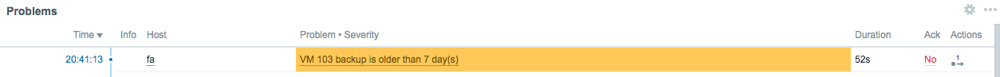

# Zabbix Template: Proxmox VMs Backup Status

*This is a "fork" from [MR_Andrew, 2018](https://share.zabbix.com/virtualization/proxmox/proxmox-vms-backup-status-template)*

This template will help you check the result of scheduled build-in backups in Proxmox. Based on 2 scripts: discovery script that will find VM numbers and check if backup enabled; monitoring script that will do all other staff.

You can make any changes in template as you wish.



## Installation

1. Setup backup procedure on needed Proxmox server in web interface.
2. Copy all **scripts** to `/etc/zabbix/scripts/` and make them executable

   ```bash
   mkdir -p /etc/zabbix/scripts
   cd /etc/zabbix/scripts
   chmod +x proxmox*
   ```
   
3. Copy **userparameter_proxmox.conf** to `/etc/zabbix/zabbix_agentd.d`

4. Add the following to /etc/sudoers:

	```
	zabbix ALL=(ALL) NOPASSWD: /etc/zabbix/scripts/proxmox-vms-discovery
	zabbix ALL=(ALL) NOPASSWD: /etc/zabbix/scripts/proxmox-vms-backup-status
	```
	
	Verify sudo file with:
	
	```bash
	visudo -c
	```

5. Import template to Zabbix Server and apply to needed host
6. Restart the Zabbix agent.
